# HelloBot 전체 ERD — 도메인별 관계도

> 기준: `docs/dev_hellobot.dump` (350개 테이블, FK 155개)
> 파티션 테이블 제외, FK로 연결된 테이블만 표시

## 도메인별 테이블 현황

| 도메인 | 테이블 수 | 주요 테이블 |
|--------|----------|------------|
| 기타/공통 | 61 | user, goods, rank, evaluation_emoji, banner |
| 파티션 | 38 | attribute_p_*, new_chat_message_partition_* |
| 유저 | 25 | user_*, user_dormant |
| 챗봇 | 24 | chatbot, block, block_group, rule, message |
| 코인/결제 | 21 | coin_*, payment, package_product, product |
| 스킬(고정메뉴) | 19 | fixed_menu_*, skill_*, premium_skill_* |
| QA/AI | 16 | qa_*, checkpoint_*, ai_* |
| 쿠폰/커머스 | 14 | coupon_*, cafe24_*, coupc_* |
| 스냅샷 | 14 | snapshot_* |
| 이벤트 | 13 | event_* |
| 운세/점술 | 10 | daily_fortune_*, saju_guide, mansedata |
| 검색 | 9 | search_* |
| 광고 | 7 | adison_*, ad_*, tapjoy |
| 컬렉션 | 7 | collection_* |
| 리포트 | 7 | relation_report_*, summary_report |
| 알림/푸시 | 6 | noti, push_* |
| 출석 | 5 | attendance_* |
| 배너 | 5 | banner, featured_banner_* |
| 잡담 | 5 | chitchat_* |
| 홈/전시 | 5 | home_*, exhibition_* |
| 퍼스널챗봇 | 5 | personal_chatbot_* |
| 트레이닝 | 5 | training_* |
| 채팅 | 4 | chat_room, chat_log, chat_typing |
| 궁합 | 4 | compatibility_* |
| 매칭 | 4 | matching_* |
| 추천 | 4 | recommended_* |
| 위시카드 | 4 | wish_card_* |
| 선물 | 3 | gift_emoji, giftiel_* |
| 사이좋은 사이 | 2 | between_* |
| 온보딩 | 2 | onboarding_chatbot, outro_recommended_skill |
| 프로모션 | 2 | promotion, promotion_element |

## 전체 FK 관계도

```mermaid
erDiagram
    %% ===== 핵심 허브 테이블 =====
    user {
        int seq PK
        string _domain_ "유저 — 50개 테이블이 참조"
    }
    chatbot {
        int seq PK
        string _domain_ "챗봇 — 40개 테이블이 참조"
    }
    fixed_menu {
        int seq PK
        string _domain_ "스킬 — 9개 테이블이 참조"
    }

    %% ===== 챗봇 도메인 =====
    block { string _d_ "챗봇" }
    block_group { string _d_ "챗봇" }
    chatbot_category { string _d_ "챗봇" }
    chatbot_sort { string _d_ "챗봇" }
    message { string _d_ "챗봇" }
    rule { string _d_ "챗봇" }
    miss_rule { string _d_ "챗봇" }
    ability { string _d_ "챗봇" }
    chatbot_data { string _d_ "챗봇" }
    chatbot_follow { string _d_ "챗봇" }
    chatbot_goods { string _d_ "챗봇" }
    chatbot_link { string _d_ "챗봇" }
    chatbot_notification { string _d_ "챗봇" }
    chatbot_stat { string _d_ "챗봇" }
    chatbot_category_relation { string _d_ "챗봇" }
    chatbot_sort_relation { string _d_ "챗봇" }
    chatbot_product_log { string _d_ "챗봇" }
    chatbot_product_quota { string _d_ "챗봇" }

    %% ===== 코인/결제 도메인 =====
    coin { string _d_ "코인_결제" }
    coin_product { string _d_ "코인_결제" }
    coin_product_category { string _d_ "코인_결제" }
    coin_product_group { string _d_ "코인_결제" }
    coin_product_coin_product_group { string _d_ "코인_결제" }
    coin_product_detail_log { string _d_ "코인_결제" }
    coin_product_pop_up_log { string _d_ "코인_결제" }
    coin_purchase_event { string _d_ "코인_결제" }
    coin_purchase_event_log { string _d_ "코인_결제" }
    payment { string _d_ "코인_결제" }
    package_product { string _d_ "코인_결제" }
    package_product_item { string _d_ "코인_결제" }

    %% ===== 유저 도메인 =====
    user_token { string _d_ "유저" }
    user_property { string _d_ "유저" }
    user_push_settings { string _d_ "유저" }
    user_rank_log { string _d_ "유저" }
    user_report_log { string _d_ "유저" }
    user_blockers_user { string _d_ "유저" }
    user_dormant { string _d_ "유저" }
    user_subscription { string _d_ "유저" }
    user_subscription_log { string _d_ "유저" }
    user_package_product_storage { string _d_ "유저" }
    user_package_product_item_storage { string _d_ "유저" }

    %% ===== 스킬 도메인 =====
    fixed_menu_evaluation { string _d_ "스킬" }
    fixed_menu_evaluation_report { string _d_ "스킬" }
    fixed_menu_tag { string _d_ "스킬" }
    fixed_menu_fixed_menu_tags_fixed_menu_tag { string _d_ "스킬" }
    premium_skill_log { string _d_ "스킬" }
    premium_skill_user_record { string _d_ "스킬" }

    %% ===== 채팅 =====
    chat_room { string _d_ "채팅" }

    %% ===== 검색 =====
    search_history { string _d_ "검색" }
    search_history_skill_matching { string _d_ "검색" }
    search_history_tag_matching { string _d_ "검색" }
    search_result_click_tracking { string _d_ "검색" }
    search_result_map { string _d_ "검색" }
    search_tag { string _d_ "검색" }
    search_tag_group { string _d_ "검색" }

    %% ===== 배너 =====
    featured_banner { string _d_ "배너" }
    featured_banner_group { string _d_ "배너" }
    featured_banner_featured_banner_group { string _d_ "배너" }
    new_skill_banner { string _d_ "배너" }
    event_banner { string _d_ "이벤트" }
    banner { string _d_ "배너" }

    %% ===== 기타 =====
    evaluation_emoji { string _d_ "기타" }
    goods { string _d_ "기타" }
    goods_click { string _d_ "기타" }
    rank { string _d_ "기타" }
    heart_log { string _d_ "기타" }
    heart_log_detail { string _d_ "기타" }
    scrap { string _d_ "기타" }
    report_archive { string _d_ "리포트" }
    tarot_report_log { string _d_ "리포트" }
    noti { string _d_ "알림" }
    noti_click_log { string _d_ "알림" }
    today_free_schedules { string _d_ "기타" }
    random_unique_log { string _d_ "기타" }
    moment_of_conversation { string _d_ "기타" }
    moment_of_conversation_report { string _d_ "기타" }
    audio_play_record { string _d_ "기타" }
    result_image_storage { string _d_ "기타" }
    product_time_attack_log { string _d_ "기타" }
    giftiel_coupon_log { string _d_ "선물" }

    %% ===== 잡담 =====
    chitchat_block_trigger { string _d_ "잡담" }
    chitchat_eval_block { string _d_ "잡담" }
    chitchat_response_eval { string _d_ "잡담" }
    chitchat_user_trained_response { string _d_ "잡담" }

    %% ===== 이벤트 =====
    event { string _d_ "이벤트" }
    event_code { string _d_ "이벤트" }
    event_amoonyang_users { string _d_ "이벤트" }
    event_amoonyang_schools { string _d_ "이벤트" }
    korean_school { string _d_ "기타" }

    %% ===== 매칭 =====
    matching_evaluation { string _d_ "매칭" }
    matching_options { string _d_ "매칭" }
    matching_quick_requests { string _d_ "매칭" }
    matching_types { string _d_ "매칭" }

    %% ===== 퍼스널챗봇 =====
    personal_chatbot { string _d_ "퍼스널챗봇" }
    personal_chatbot_code { string _d_ "퍼스널챗봇" }
    personal_chatbot_code_reference { string _d_ "퍼스널챗봇" }
    personal_chatbot_fixed_menu { string _d_ "퍼스널챗봇" }

    %% ===== 추천 =====
    recommended_by_time_banner { string _d_ "추천" }
    recommended_fixed_menu_group { string _d_ "추천" }
    recommended_fixed_menu_group_fixed_menus { string _d_ "추천" }

    %% ===== 홈 =====
    home_tab { string _d_ "홈" }
    home_section { string _d_ "홈" }

    %% ===== 스냅샷 =====
    snapshot_fixed_menu { string _d_ "스냅샷" }
    snapshot_fixed_menu_description_detail { string _d_ "스냅샷" }
    snapshot_fixed_menu_description_image { string _d_ "스냅샷" }
    snapshot_fixed_menu_tag { string _d_ "스냅샷" }
    snapshot_fixed_menu_tags_fixed_menu_tag { string _d_ "스냅샷" }
    snapshot_report_group { string _d_ "스냅샷" }
    snapshot_report { string _d_ "스냅샷" }
    snapshot_report_product { string _d_ "스냅샷" }

    %% ===== 쿠폰 =====
    cafe24_product { string _d_ "쿠폰" }
    cafe24_product_linking_product { string _d_ "쿠폰" }
    cafe24_coupon_file { string _d_ "쿠폰" }

    %% ===== 사이좋은 사이 =====
    between_chat_room { string _d_ "사이좋은사이" }

    %% ========================================
    %% FK 관계 — user 중심
    %% ========================================
    user ||--o{ coin : "user_seq"
    user ||--o{ payment : "user_seq"
    user ||--o{ chat_room : "user_seq"
    user ||--o{ chatbot_follow : "user_seq"
    user ||--o{ chatbot_notification : "user_seq"
    user ||--o{ chatbot_product_log : "user_seq"
    user ||--o{ user_token : "user_seq"
    user ||--o{ user_property : "user_seq"
    user ||--o{ user_push_settings : "user_seq"
    user ||--o{ user_rank_log : "user_seq"
    user ||--o{ user_report_log : "user_seq"
    user ||--o{ user_blockers_user : "user_seq_1"
    user ||--o{ user_package_product_storage : "user_seq"
    user ||--o{ user_package_product_item_storage : "user_seq"
    user ||--o{ noti : "user_seq"
    user ||--o{ noti_click_log : "user_seq"
    user ||--o{ scrap : "user_seq"
    user ||--o{ report_archive : "user_seq"
    user ||--o{ heart_log : "user_seq"
    user ||--o{ premium_skill_log : "user_seq"
    user ||--o{ premium_skill_user_record : "user_seq"
    user ||--o{ fixed_menu_evaluation : "user_seq"
    user ||--o{ fixed_menu_evaluation_report : "user_seq"
    user ||--o{ coin_product_detail_log : "user_seq"
    user ||--o{ coin_product_pop_up_log : "user_seq"
    user ||--o{ coin_purchase_event_log : "user_seq"
    user ||--o{ personal_chatbot : "user_seq"
    user ||--o{ miss_rule : "user_seq"
    user ||--o{ random_unique_log : "user_seq"
    user ||--o{ goods_click : "user_seq"
    user ||--o{ matching_evaluation : "target_user_seq"
    user ||--o{ chitchat_response_eval : "user_seq"
    user ||--o{ moment_of_conversation : "user_seq"
    user ||--o{ moment_of_conversation_report : "user_seq"
    user ||--o{ adison_campaign_log : "user_seq"
    user ||--o{ adison_log : "user_seq"
    user ||--o{ audio_play_record : "user_seq"
    user ||--o{ result_image_storage : "user_seq"
    user ||--o{ product_time_attack_log : "user_seq"
    user ||--o{ tarot_report_log : "user_seq"
    user ||--o{ giftiel_coupon_log : "user_seq"
    user ||--o{ event_amoonyang_users : "user_seq"

    %% ========================================
    %% FK 관계 — chatbot 중심
    %% ========================================
    chatbot ||--o{ ability : "chatbot_seq"
    chatbot ||--o{ block_group : "chatbot_seq"
    chatbot ||--o{ block : "chatbot_seq"
    chatbot ||--o{ rule : "chatbot_seq"
    chatbot ||--o{ miss_rule : "chatbot_seq"
    chatbot ||--o{ chatbot_data : "chatbot_seq"
    chatbot ||--o{ chatbot_follow : "chatbot_seq"
    chatbot ||--o{ chatbot_goods : "chatbot_seq"
    chatbot ||--o{ chatbot_link : "chatbot_seq"
    chatbot ||--o{ chatbot_notification : "chatbot_seq"
    chatbot ||--o{ chatbot_stat : "chatbot_seq"
    chatbot ||--o{ chatbot_category_relation : "chatbot_seq"
    chatbot ||--o{ chat_room : "chatbot_seq"
    chatbot ||--o{ fixed_menu : "chatbot_seq"
    chatbot ||--o{ fixed_menu_evaluation : "chatbot_seq"
    chatbot ||--o{ premium_skill_user_record : "chatbot_seq"
    chatbot ||--o{ personal_chatbot : "chatbot_seq"
    chatbot ||--o{ personal_chatbot_code_reference : "chatbot_seq"
    chatbot ||--o{ personal_chatbot_fixed_menu : "chatbot_seq"
    chatbot ||--o{ between_chat_room : "chatbot_seq"
    chatbot ||--o{ matching_evaluation : "chatbot_seq"
    chatbot ||--o{ matching_options : "chatbot_seq"
    chatbot ||--o{ matching_quick_requests : "chatbot_seq"
    chatbot ||--o{ chitchat_block_trigger : "chatbot_seq"
    chatbot ||--o{ chitchat_eval_block : "chatbot_seq"
    chatbot ||--o{ chitchat_response_eval : "chatbot_seq"
    chatbot ||--o{ event_banner : "chatbot_seq"
    chatbot ||--o{ featured_banner : "chatbot_seq"
    chatbot ||--o{ new_skill_banner : "chatbot_seq"
    chatbot ||--o{ recommended_by_time_banner : "chatbot_seq"
    chatbot ||--o{ today_free_schedules : "chatbot_seq"
    chatbot ||--o{ package_product_item : "chatbot_seq"

    %% ========================================
    %% FK 관계 — fixed_menu 중심
    %% ========================================
    fixed_menu ||--o{ event_banner : "fixed_menu_seq"
    fixed_menu ||--o{ featured_banner : "fixed_menu_seq"
    fixed_menu ||--o{ new_skill_banner : "fixed_menu_seq"
    fixed_menu ||--o{ recommended_by_time_banner : "fixed_menu_seq"
    fixed_menu ||--o{ today_free_schedules : "fixed_menu_seq"
    fixed_menu ||--o{ personal_chatbot_fixed_menu : "fixed_menu_seq"
    fixed_menu ||--o{ search_history_skill_matching : "fixed_menu_seq"
    fixed_menu ||--o{ search_result_click_tracking : "fixed_menu_seq"
    fixed_menu ||--o{ search_result_map : "fixed_menu_seq"

    %% ========================================
    %% FK 관계 — 도메인 내부
    %% ========================================
    block_group ||--o{ block : "block_group_seq"
    block ||--o{ message : "block_seq"
    block ||--o{ chitchat_eval_block : "block_seq"
    chatbot_category ||--o{ chatbot_category_relation : "chatbot_category_seq"
    chatbot_category ||--o{ chatbot_sort_relation : "chatbot_category_seq"
    chatbot_sort ||--o{ chatbot_sort_relation : "chatbot_sort_seq"
    chatbot_product_log ||--o{ chatbot_product_quota : "chatbot_product_log_seq"
    goods ||--o{ chatbot_goods : "goods_seq"
    goods ||--o{ goods_click : "goods_seq"
    evaluation_emoji ||--o{ fixed_menu_evaluation : "eval_emoji_seq"
    evaluation_emoji ||--o{ matching_evaluation : "eval_emoji_seq"
    fixed_menu_evaluation ||--o{ fixed_menu_evaluation_report : "fixed_menu_evaluation_seq"
    fixed_menu_tag ||--o{ fixed_menu_fixed_menu_tags_fixed_menu_tag : "tag_seq"
    matching_types ||--o{ matching_quick_requests : "type"
    coin_product_category ||--o{ coin_product : "category_seq"
    coin_product ||--o{ coin_product_coin_product_group : "coin_product_seq"
    coin_product_group ||--o{ coin_product_coin_product_group : "coin_product_group_seq"
    coin_purchase_event ||--o{ coin_purchase_event_log : "event_seq"
    package_product ||--o{ package_product_item : "package_product_seq"
    package_product ||--o{ user_package_product_storage : "package_product_seq"
    package_product_item ||--o{ user_package_product_item_storage : "package_item_seq"
    user_package_product_storage ||--o{ user_package_product_item_storage : "package_storage_seq"
    user_subscription ||--o{ user_subscription_log : "user_subscription_seq"
    rank ||--o{ user_dormant : "rank_seq"
    heart_log ||--o{ heart_log_detail : "heart_log_seq"
    chitchat_response_eval ||--o{ chitchat_user_trained_response : "chitchat_response_eval_seq"
    personal_chatbot_code_reference ||--o{ personal_chatbot_code : "reference_seq"
    moment_of_conversation ||--o{ moment_of_conversation_report : "moment_seq"
    event ||--o{ event_code : "event_seq"
    korean_school ||--o{ event_amoonyang_schools : "school_seq"
    korean_school ||--o{ event_amoonyang_users : "school_seq"
    featured_banner ||--o{ featured_banner_featured_banner_group : "featured_banner_seq"
    featured_banner_group ||--o{ featured_banner_featured_banner_group : "featured_banner_group_seq"
    banner ||--o{ today_free_schedules : "banner_seq"
    home_tab ||--o{ home_section : "home_tab_seq"
    search_history ||--o{ search_history_skill_matching : "history_seq"
    search_history ||--o{ search_history_tag_matching : "history_seq"
    search_history ||--o{ search_result_click_tracking : "history_seq"
    search_tag ||--o{ search_history_tag_matching : "tag_seq"
    search_tag_group ||--o{ search_tag : "tag_group_seq"
    search_tag_group ||--o{ search_result_map : "tag_group_seq"
    recommended_fixed_menu_group ||--o{ recommended_fixed_menu_group_fixed_menus : "group_seq"
    cafe24_product ||--o{ cafe24_product_linking_product : "cafe24_product_id"
    cafe24_product_linking_product ||--o{ cafe24_coupon_file : "cafe24_product_linking_product_seq"
    snapshot_fixed_menu ||--o{ snapshot_fixed_menu_description_detail : "fixed_menu_seq"
    snapshot_fixed_menu ||--o{ snapshot_fixed_menu_description_image : "fixed_menu_seq"
    snapshot_fixed_menu ||--o{ snapshot_fixed_menu_tags_fixed_menu_tag : "fixed_menu_seq"
    snapshot_fixed_menu_tag ||--o{ snapshot_fixed_menu_tags_fixed_menu_tag : "tag_seq"
    snapshot_report_group ||--o{ snapshot_report : "report_group_seq"
    snapshot_report_group ||--o{ snapshot_report_product : "report_group_seq"
```

