# HelloBot ERD — 유저/결제/행동 도메인 상세

> 기준: `docs/dev_hellobot.dump`
> 사용자 속성, 행동 로그, 결제/코인, 구독 관련 테이블 상세 ERD

## 테이블 요약

| 그룹 | 테이블 | 설명 |
|------|--------|------|
| **유저 기본** | user | 메인 유저 테이블 (30개 컬럼, 50개 테이블이 FK 참조) |
| | user_dormant | 휴면 유저 (user와 동일 구조 + rank_seq) |
| | user_token | 리프레시 토큰 관리 |
| | user_property | 유저별 속성 (이름-타입-값 KV) |
| | user_property_character | 속성 문자 정보 (다국어) |
| | user_push_settings | 푸시 알림 설정 |
| | user_push_settings_sync_log | 푸시 설정 동기화 로그 |
| | user_blockers_user | 유저 차단 관계 (M:N) |
| | user_test_group | 테스트 그룹 배정 |
| | user_quit_reason | 탈퇴 사유 |
| **결제/코인** | coin | 코인 입출금 내역 |
| | coin_log | 코인 사용 로그 (챗봇/블록별) |
| | coin_product | 코인 상품 정의 |
| | coin_product_category | 상품 카테고리 |
| | coin_product_group | 상품 그룹 (국가/언어별) |
| | coin_product_coin_product_group | 상품-그룹 M:N |
| | coin_product_banner | 상품 배너 |
| | coin_product_detail_log | 상품 상세 조회 로그 |
| | coin_product_pop_up_log | 상품 팝업 노출/구매 로그 |
| | coin_material | 재화 정의 |
| | coin_material_bank | 재화 발행/소비 한도 |
| | coin_material_log | 재화 지급 로그 |
| | coin_purchase_event | 코인 구매 이벤트 정의 |
| | coin_purchase_event_log | 구매 이벤트 참여 로그 |
| | payment | 결제 트랜잭션 |
| | payment_inquiry | 결제 문의 |
| | product | IAP 상품 정의 |
| **구독** | user_subscription | 구독 정보 (영수증, 플랫폼) |
| | user_subscription_log | 구독 상태 변경 로그 |
| | user_billing_key | 빌링키 (자동결제) |
| | user_billing_log | 빌링 결제 로그 |
| **패키지** | package_product | 패키지 상품 정의 |
| | package_product_item | 패키지 구성 아이템 |
| | user_package_product_storage | 유저 패키지 보유 현황 |
| | user_package_product_item_storage | 유저 패키지 아이템 사용 현황 |
| **행동 로그** | user_played_skill | 스킬 플레이 기록 |
| | user_purchased_skill | 스킬 구매 기록 |
| | user_free_chat | 무료 채팅 잔여 횟수 |
| | chat_room | 채팅방 (유저-챗봇) |
| | chatbot_follow | 챗봇 팔로우 |
| | scrap | 스킬 스크랩 |
| | report_archive | 리포트 저장소 |
| | user_material_storage | 유저 재화 보유 |
| | user_rank_log | 등급 변경 로그 |
| | user_reward_log | 보상 수령 로그 |
| | user_event_history | 이벤트 참여 이력 |
| | user_promotion_event | 프로모션 참여 |
| | user_quest_history | 퀘스트 완료 이력 |
| | user_report_log | 신고 로그 |
| | user_has_relation_report | 궁합 리포트 보유 |
| **출석** | attendance_log | 출석 체크 로그 |
| | attendance_rewards | 출석일별 보상 정의 |
| | attendance_roulette_set | 룰렛 세트 |
| | attendance_roulette_reward | 룰렛 보상 정의 |
| | attendance_roulette_log | 룰렛 결과 로그 |
| **등급** | rank | 등급 정의 |
| **기타** | referral | 추천인 정의 |
| | login_option | 로그인 옵션 (국가/플랫폼별) |
| | policy_consent_log | 약관 동의 로그 |

## 상세 ERD

```mermaid
erDiagram
    %% =============================================
    %% 유저 기본
    %% =============================================
    user {
        int seq PK
        varchar email
        varchar password
        varchar type "NOT NULL (normal/sns)"
        varchar name
        varchar profile_url
        varchar thumbnail_url
        timestamptz create_at "NOT NULL"
        timestamptz signin_at
        text refresh_token
        varchar sns_id
        varchar mobile_token
        varchar mobile_type
        timestamptz signup_at
        boolean is_certificated "NOT NULL"
    }

    user_dormant {
        int seq "NOT NULL (user.seq)"
        varchar email
        varchar type "NOT NULL"
        timestamptz create_at "NOT NULL"
        int rank_seq "FK → rank"
        boolean agree_kakao_marketing "NOT NULL"
    }

    user_token {
        int seq PK
        int user_seq "FK → user"
        text refresh_token
        timestamptz created_at
        varchar os
        boolean is_mobile
    }

    user_property {
        int seq PK
        int user_seq "FK → user, NOT NULL"
        varchar name "NOT NULL"
        varchar type
        varchar value
        boolean is_skip
    }

    user_push_settings {
        int seq PK
        int user_seq "FK → user, NOT NULL"
        boolean app_on "NOT NULL"
        boolean day_on "NOT NULL"
        boolean night_on "NOT NULL"
        boolean fortune_of_today_on
        boolean bonus_heart_on
        boolean chatroom_on
        boolean follow_on
        boolean attendance_check_on
    }

    user_blockers_user {
        int user_seq_1 "FK → user"
        int user_seq_2 "FK → user"
    }

    user_test_group {
        int seq PK
        int user_seq "NOT NULL"
        varchar email "NOT NULL"
    }

    %% =============================================
    %% 결제 / 코인
    %% =============================================
    coin {
        bigint seq PK
        int user_seq "FK → user, NOT NULL"
        varchar text "NOT NULL"
        int deposit
        int withdraw
        int balance "NOT NULL"
        enum type "NOT NULL"
        varchar product_id
        text receipt
    }

    coin_log {
        bigint seq PK
        int user_seq "NOT NULL"
        int chatbot_seq "NOT NULL"
        int block_seq "NOT NULL"
        varchar coin_type "NOT NULL"
        int purchased_value "NOT NULL"
    }

    coin_product {
        int seq PK
        int category_seq "FK → coin_product_category"
        varchar product_id
        varchar title
        int quantity
        int original_price
        int discount_price
        int discount_rate
        varchar os
    }

    coin_product_category {
        int seq PK
        varchar name
        varchar category "NOT NULL"
        varchar product_name "NOT NULL"
    }

    coin_product_group {
        int seq PK
        varchar name "NOT NULL"
        varchar country_code "NOT NULL"
        varchar language_code "NOT NULL"
    }

    coin_product_coin_product_group {
        int seq PK
        int coin_product_seq "FK → coin_product"
        int coin_product_group_seq "FK → coin_product_group"
    }

    coin_material {
        int seq PK
        varchar title "NOT NULL"
        double ratio
        boolean subscription "NOT NULL"
    }

    coin_material_bank {
        int seq PK
        int currency_id "NOT NULL"
        int publish_amount "NOT NULL"
        int consume_amount "NOT NULL"
        int daily_limit "NOT NULL"
        int year_limit "NOT NULL"
    }

    coin_material_log {
        int seq PK
        int currency_id "NOT NULL"
        int user_seq "NOT NULL"
        int currency_value
        boolean convert_heart
        varchar reward_key "NOT NULL"
    }

    coin_purchase_event {
        int seq PK
        varchar title "NOT NULL"
        boolean is_in_progress "NOT NULL"
        int goal_purchased_heart_sum "NOT NULL"
        varchar country_code "NOT NULL"
    }

    coin_purchase_event_log {
        int seq PK
        int user_seq "FK → user, NOT NULL"
        int event_seq "FK → coin_purchase_event"
        int current_purchased_heart_sum "NOT NULL"
        boolean has_participated "NOT NULL"
    }

    coin_product_detail_log {
        int seq PK
        int user_seq "FK → user"
        varchar type
        varchar detail
    }

    coin_product_pop_up_log {
        int seq PK
        int user_seq "FK → user"
        varchar product_id "NOT NULL"
        boolean is_purchased "NOT NULL"
    }

    payment {
        int seq PK
        int user_seq "FK → user"
        varchar transaction_id "NOT NULL"
        varchar product_name "NOT NULL"
        double amount "NOT NULL"
        varchar currency "NOT NULL"
        varchar status "NOT NULL"
        varchar product_type "NOT NULL"
        boolean is_used "NOT NULL"
    }

    payment_inquiry {
        int seq PK
        int user_seq
        varchar name "NOT NULL"
        varchar phone "NOT NULL"
        varchar email "NOT NULL"
        varchar payment_method "NOT NULL"
        text content "NOT NULL"
    }

    product {
        int seq PK
        varchar product_id "NOT NULL"
        enum os "NOT NULL"
        varchar title "NOT NULL"
        enum type "NOT NULL"
        int price "NOT NULL"
        int heart "NOT NULL"
        boolean visible "NOT NULL"
    }

    %% =============================================
    %% 구독 / 빌링
    %% =============================================
    user_subscription {
        int seq PK
        int user_seq "NOT NULL"
        varchar product_id "NOT NULL"
        enum os "NOT NULL"
        varchar receipt "NOT NULL"
        varchar original_transaction_id
        timestamptz will_be_expired_at
        int user_billing_key_seq
    }

    user_subscription_log {
        int seq PK
        enum type "NOT NULL"
        int user_subscription_seq "FK → user_subscription"
        int user_seq "NOT NULL"
        varchar product_id "NOT NULL"
    }

    user_billing_key {
        int seq PK
        int user_seq "NOT NULL"
        varchar customer_key "NOT NULL"
        varchar billing_key "NOT NULL"
        jsonb metadata
    }

    user_billing_log {
        int seq PK
        int user_billing_key_seq "NOT NULL"
        int amount "NOT NULL"
        varchar currency "NOT NULL"
        jsonb metadata
    }

    %% =============================================
    %% 패키지 상품
    %% =============================================
    package_product {
        int seq PK
        varchar title "NOT NULL"
        int price "NOT NULL"
        timestamptz open_date "NOT NULL"
        boolean is_open "NOT NULL"
        boolean is_released "NOT NULL"
    }

    package_product_item {
        int seq PK
        int package_product_seq "FK → package_product"
        int chatbot_seq "FK → chatbot"
        int fixed_menu_seq
        int block_seq
        int turn
    }

    user_package_product_storage {
        int seq PK
        int user_seq "FK → user"
        int package_product_seq "FK → package_product"
        boolean is_refunded "NOT NULL"
    }

    user_package_product_item_storage {
        int seq PK
        int user_seq "FK → user"
        int package_storage_seq "FK → user_package_product_storage"
        int package_item_seq "FK → package_product_item"
        boolean used "NOT NULL"
    }

    %% =============================================
    %% 행동 로그
    %% =============================================
    user_played_skill {
        int seq PK
        int user_seq "NOT NULL"
        int skill_seq "NOT NULL"
        varchar name
        json blocks "NOT NULL"
        json attributes "NOT NULL"
        enum status "NOT NULL"
        int chat_room_seq "NOT NULL"
    }

    user_purchased_skill {
        int seq PK
        int user_seq "NOT NULL"
        int skill_seq "NOT NULL"
        enum os "NOT NULL"
        int used_heart "NOT NULL"
        int used_bonus_heart "NOT NULL"
        double used_price_amount "NOT NULL"
    }

    user_free_chat {
        int seq PK
        int user_seq "NOT NULL"
        int chatbot_seq "NOT NULL"
        int assigned_count "NOT NULL"
        int remaining_count "NOT NULL"
    }

    chat_room {
        int seq PK
        int user_seq "FK → user"
        int chatbot_seq "FK → chatbot"
        varchar status "NOT NULL"
        json last_messages
        int chat_count "NOT NULL"
    }

    chatbot_follow {
        int seq PK
        int user_seq "FK → user, NOT NULL"
        int chatbot_seq "FK → chatbot"
    }

    scrap {
        int seq PK
        int user_seq "FK → user, NOT NULL"
        int fixed_menu_seq "NOT NULL"
    }

    report_archive {
        int seq PK
        text uid "NOT NULL"
        int user_seq "FK → user"
        int chatbot_seq "NOT NULL"
        varchar name "NOT NULL"
        varchar type "NOT NULL"
        json report_data
    }

    user_material_storage {
        int seq PK
        int user_seq "NOT NULL"
        int currency_id "NOT NULL"
        int amount "NOT NULL"
    }

    user_rank_log {
        int seq PK
        int user_seq "FK → user"
        int rank_seq
        text description
    }

    user_reward_log {
        int seq PK
        int user_seq "NOT NULL"
        int reward_seq "NOT NULL"
        varchar email
        varchar phone
    }

    user_event_history {
        int seq PK
        int user_seq "NOT NULL"
        int event_seq "NOT NULL"
        int current_event_count "NOT NULL"
    }

    user_promotion_event {
        int seq PK
        int user_seq "NOT NULL"
        int promotion_seq "NOT NULL"
        varchar type "NOT NULL"
        json data "NOT NULL"
    }

    user_quest_history {
        int seq PK
        int user_seq "NOT NULL"
        int quest_seq "NOT NULL"
    }

    user_report_log {
        int seq PK
        int user_seq "FK → user"
        text description
        uuid channel_id
    }

    user_has_relation_report {
        int seq PK
        int user_seq "NOT NULL"
        int report_seq "NOT NULL"
        int skill_seq "NOT NULL"
    }

    %% =============================================
    %% 출석
    %% =============================================
    attendance_log {
        int seq PK
        int user_seq
    }

    attendance_rewards {
        int day "NOT NULL"
        int roulette "NOT NULL"
    }

    attendance_roulette_set {
        int seq PK
        varchar name
        varchar roulette_image_url "NOT NULL"
        boolean active
    }

    attendance_roulette_reward {
        int seq PK
        int set_seq
        enum type "NOT NULL"
        int count "NOT NULL"
        double probability "NOT NULL"
        int turn "NOT NULL"
    }

    attendance_roulette_log {
        int seq PK
        int user_seq
        enum reward_type "NOT NULL"
        int reward_count "NOT NULL"
        int set_seq
        int degree
    }

    %% =============================================
    %% 등급
    %% =============================================
    rank {
        int seq PK
        int level "NOT NULL"
        varchar name "NOT NULL"
        int price_condition "NOT NULL"
        boolean active "NOT NULL"
    }

    %% =============================================
    %% 기타
    %% =============================================
    policy_consent_log {
        int seq PK
        int user_seq "NOT NULL"
        int policy_seq "NOT NULL"
    }

    login_option {
        int seq PK
        enum option "NOT NULL"
        int order "NOT NULL"
        varchar country_code "NOT NULL"
        enum platform "NOT NULL"
    }

    referral {
        int seq PK
        int fixed_menu_seq "NOT NULL"
        int reward "NOT NULL"
        boolean is_open "NOT NULL"
    }

    %% =============================================
    %% 관계 — 유저 기본
    %% =============================================
    user ||--o{ user_token : "user_seq"
    user ||--o{ user_property : "user_seq"
    user ||--o{ user_push_settings : "user_seq"
    user ||--o{ user_blockers_user : "user_seq_1 / user_seq_2"
    rank ||--o{ user_dormant : "rank_seq"

    %% =============================================
    %% 관계 — 결제/코인
    %% =============================================
    user ||--o{ coin : "user_seq"
    user ||--o{ payment : "user_seq"
    user ||--o{ coin_product_detail_log : "user_seq"
    user ||--o{ coin_product_pop_up_log : "user_seq"
    user ||--o{ coin_purchase_event_log : "user_seq"
    coin_product_category ||--o{ coin_product : "category_seq"
    coin_product ||--o{ coin_product_coin_product_group : "coin_product_seq"
    coin_product_group ||--o{ coin_product_coin_product_group : "coin_product_group_seq"
    coin_purchase_event ||--o{ coin_purchase_event_log : "event_seq"

    %% =============================================
    %% 관계 — 구독/빌링
    %% =============================================
    user_subscription ||--o{ user_subscription_log : "user_subscription_seq"

    %% =============================================
    %% 관계 — 패키지
    %% =============================================
    package_product ||--o{ package_product_item : "package_product_seq"
    user ||--o{ user_package_product_storage : "user_seq"
    package_product ||--o{ user_package_product_storage : "package_product_seq"
    user ||--o{ user_package_product_item_storage : "user_seq"
    user_package_product_storage ||--o{ user_package_product_item_storage : "package_storage_seq"
    package_product_item ||--o{ user_package_product_item_storage : "package_item_seq"

    %% =============================================
    %% 관계 — 행동 로그
    %% =============================================
    user ||--o{ chat_room : "user_seq"
    user ||--o{ chatbot_follow : "user_seq"
    user ||--o{ scrap : "user_seq"
    user ||--o{ report_archive : "user_seq"
    user ||--o{ user_rank_log : "user_seq"
    user ||--o{ user_report_log : "user_seq"
```

