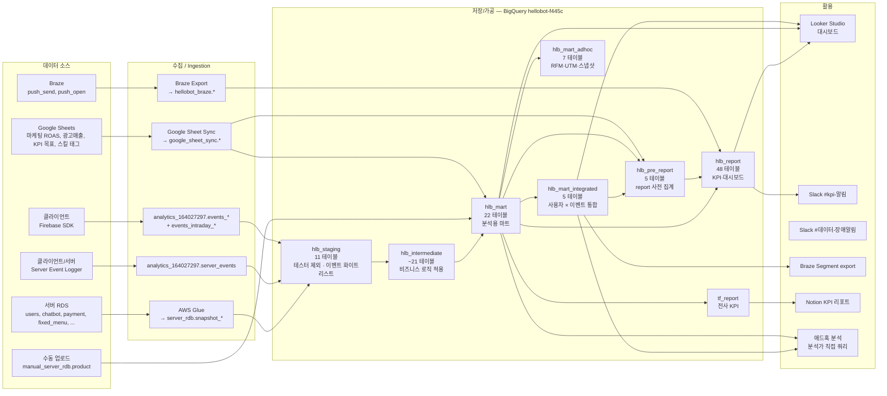

# 데이터 인프라 아키텍처 (HelloBot)

> 수집 → 저장 → 가공 → 활용 전체 흐름과 구성 요소를 한 장에.
> 세부는 각 카탈로그/사전/플레이북 참조.

---

## 1. 전체 흐름 (한눈에)



> 실패 시 Slack 알림(`#데이터-장애알림`)은 **모든 DAG** 에 `on_failure_callback` 으로 연결됨.

---

## 2. 계층별 역할

| 계층 (데이터셋) | 역할 | 누가 쓰나 | 개수 |
|---|---|---|---|
| `hlb_staging` | 원본 수집 + 테스터 제외 + 이벤트 필터링 | 분석가 드물게 (`staging_key_events_fb` 만) | 11 |
| `hlb_intermediate` | 테이블 조인, 비즈니스 로직 적용, 유저 정보 병합 | 파이프라인 내부용 | ~21 |
| `hlb_mart` | 분석용 최종 마트 (도메인별) | **분석가 · 대시보드 · union** | 22 |
| `hlb_mart_integrated` | 사용자 × 이벤트 통합 (union + 메타/RFM/퍼널) | **분석의 본진** | 5 |
| `hlb_mart_adhoc` | RFM, UTM, 일별 스냅샷 | RFM/타겟팅 | 7 |
| `hlb_pre_report` | report 사전 집계 (cohort, OKR 등) | report 파이프라인 내부 | 5 |
| `hlb_report` | KPI/매출/리텐션/CRM 최종 리포트 | 대시보드·Slack 알림 | ~48 |
| `tf_report` | ThingsFlow 전사 KPI (HLB 기여) | 경영진 Notion 리포트 | 2 |

### 파이프라인 계층 원칙
- `staging → intermediate → mart → mart_integrated → pre_report → report`
- 원칙: **하위 계층이 상위 계층을 참조하지 않음**
- 예외 발견: `mart_skill_open_date_se` 가 같은 mart 를 참조 ([ISS-003](./issues.md))

---

## 3. DAG 체인

```
┌─────────────────────────────────────────────────────────────┐
│  hellobot_datamart_staging_pipeline                         │
│  schedule: "0 2 * * *" (UTC) = KST 11:00                    │
│  owner: 파이프라인의 유일한 "트리거 시점"                    │
└─────────┬───────────────────────────────────────────────────┘
          │ TriggerDagRunOperator
          ▼
┌─────────────────────────────────────────────────────────────┐
│  hellobot_datamart_intermediate_pipeline                    │
└─────────┬───────────────────────────────────────────────────┘
          ▼
┌─────────────────────────────────────────────────────────────┐
│  hellobot_datamart_mart_pipeline                            │
└─────────┬───────────────────────────────────────────────────┘
          ▼
┌─────────────────────────────────────────────────────────────┐
│  hellobot_datamart_mart_integrated_pipeline                 │
│  hellobot_datamart_mart_adhoc_pipeline                      │
└─────────┬───────────────────────────────────────────────────┘
          ▼
┌─────────────────────────────────────────────────────────────┐
│  hellobot_datamart_pre_report_pipeline                      │
└─────────┬───────────────────────────────────────────────────┘
          ▼
┌─────────────────────────────────────────────────────────────┐
│  hellobot_datamart_report_pipeline                          │
│  hellobot_datamart_tf_report_pipeline                       │
└─────────────────────────────────────────────────────────────┘
```

**부속 DAG (별도 실행)**
- `hellobot_daily.py` — 일별 요약
- `hellobot_ltv.py` — LTV 계산
- `hellobot_japan_*` — JP 파이프라인 (다수)
- `hellobot_snapshot_to_bigquery.py` — RDS 스냅샷
- `hlb_kpi_noti.py` — Slack KPI 알림 (수집된 데이터 사용)
- `hellobot_sync_google_sheet.py` — GSheet → BQ 동기화

---

## 4. 외부 의존 시스템 맵

### 4-1. 자동 수집
| 시스템 | 경로 | 빈도 | 관리 |
|---|---|---|---|
| Firebase GA4 | `analytics_164027297.events_*` | 실시간 (events_intraday) + 일별 | Google 자동 |
| 서버 이벤트 로거 | `analytics_164027297.server_events` | 실시간 | HelloBot 서버 팀 |
| AWS Glue (RDS 스냅샷) | `server_rdb.snapshot_*` | 일별 추정 | 확인 필요 |
| Google Sheet Sync | `google_sheet_sync.*` | 일별 | `hellobot_sync_google_sheet.py` |
| Braze Export | `hellobot_braze.*` | 일별 추정 | 확인 필요 |

### 4-2. 수동 · 개인 관리 (리스크)
| 리소스 | 담당 | 리스크 | 관련 이슈 |
|---|---|---|---|
| `manual_server_rdb.product` | 수동 업로드 | 업로드 주체·주기 불투명 | [ISS-007](./issues.md) |
| `google_sheet_sync.taenyon_temp_skill_tag_info_v2` | 데이터팀 운영자 | 단일 담당자 의존, v2 네이밍 | (내부 이슈 추적) |
| `google_sheet_sync.marketing_roas_daily` | 마케팅팀 | 수기 입력 | 확인 필요 |
| `google_sheet_sync.ad_revenue_network_daily` / `ad_revenue_direct_daily` | 경영지원? | 수기 입력 | 확인 필요 |
| `google_sheet_sync_all.hellobot_kpi_goal_monthly` | PM? | KPI 목표 수기 입력 | 확인 필요 |
| `hlb_staging.staging_key_events_*_events_list` | ? | 이벤트 수집 게이트키퍼 | [ISS-011](./issues.md) |
| `server_rdb.user_test_group` | 서버팀? | 테스터 제외 기준 | 확인 필요 |

### 4-3. 출력 채널
| 채널 | 용도 | 소스 |
|---|---|---|
| Slack `#데이터-장애알림` | DAG 실패 알림 | 모든 DAG `on_failure_callback` |
| Slack KPI 알림 | 주요 지표 일일/주간 요약 | `hlb_kpi_noti.py` |
| Looker Studio | 대시보드 | `mart`, `mart_integrated`, `report` 테이블 (매핑 TBD) |
| Braze Segment | 마케팅 세그먼트 | `mart_integrated` / `mart_adhoc` (타겟팅) |
| Notion | 전사 KPI | `tf_report.report_kpi_daily`, `report_kpi_quarterly` |

---

## 5. 공통 규약

### 5-1. 시간대
- 모든 `event_date` 는 **Asia/Seoul** 기준 (staging 단에서 UTC → KST 변환)
- `event_timestamp` 는 UTC TIMESTAMP 타입 그대로 유지

### 5-2. 사용자 식별
- **분석 표준**: `user_id_processed`
  - APP: 2019-04-01 이후 `user_id`, 이전은 `user_pseudo_id`
  - WEB: **2022-12-01** 이후 `user_id`, 이전은 `user_pseudo_id` (주석 오타 [ISS-010](./issues.md))
- 서버 이벤트: `user_id` 필수 (NULL 이면 수집 안 됨)

### 5-3. 이벤트 게이트키핑

**2-tier 화이트리스트 게이트** (실제 구현은 OR union — [ISS-014](./issues.md) 의도 vs 현실 차이 추적 중):

- Firebase: `staging_key_events_fb_events_list` (2차) ∪ `events_list` (1차) 에 등록된 이벤트만
- 서버: `staging_key_events_se_events_list` (2차) ∪ `events_list` (1차) 에 등록된 이벤트만 + `env IN ('production','prod')` (개발/스테이징 배제 — [ISS-013](./issues.md) env 필터 일관성 추적)
- 테스터: `server_rdb.user_test_group` 전부 제외
- 등록 절차: BigQuery 콘솔 `INSERT` 직접 (자동화 없음, 운영 단순화 의도) — 상세 [recipes/add-new-event.md](./recipes/add-new-event.md)

### 5-4. SSOT (Single Source of Truth) 정책

- 본 카탈로그(`docs/hellobot-data/catalog/`) = 단일 진실 원천
- 검증된 활성 이벤트 = `events_list` / `*_*_events_list` 에 등록된 이벤트만
- Notion 설계 DB = historical 참고 자료 (대다수 이벤트는 미검증 상태)
- 신규 기능 설계 시 활용 흐름: ① 본 카탈로그 검색 → ② Notion historical 매칭 → ③ BQ 검증 → ④ SSOT 등록
- 상세: [event-catalog.md §SSOT 정책](./event-catalog.md)

### 5-5. 매출 정의
- **표준 매출**: `revenue_krw` = 유료 하트 + 현금 (보너스 하트 제외)
- 보너스 하트 가치 포함 시: `spent_total_amount_krw`
- 환산: `KRW_PER_HEART = 150` (파라미터 또는 하드코딩 2곳 정의)

### 5-6. ID/이름 페어 발송 규칙 (★ 이벤트 설계 강제)

ID 파라미터(`*_seq`)를 보내는 이벤트는 대응 이름 파라미터(`*_name`) 도 함께 발송 필수. 사후 조인 비용 절감 + 시점별 명칭 변경 historical 보존.

| ID | 페어 |
|---|---|
| `menu_seq` | `menu_name` |
| `chatbot_seq` | `chatbot_name` + `chatbot_bundle_seq` + `chatbot_language` (다국어) |
| `block_seq` | `block_name` |
| `collection_seq` | `collection_name` |
| `package_seq` | `package_title` |

상세 + 미준수 사례: [event-design-guide.md §3-4](./recipes/event-design-guide.md#3-4-★-id-이름-페어-발송-규칙), [ISS-015](./issues.md).

### 5-7. 파티션 · 비용
- **현재**: 대부분 마트가 파티션 없음 → 조회 시 `WHERE event_date BETWEEN …` 필수
- dbt 이식 또는 별도 개선 시 `PARTITION BY event_date` 적용 권장 ([ISS-002](./issues.md))
- `analytics_164027297.server_events` 의 파티션 컬럼은 **`event_timestamp` (TIMESTAMP, DAY)** — `event_date` 컬럼 없음. 권장 필터: `WHERE DATE(TIMESTAMP_TRUNC(event_timestamp, DAY), 'Asia/Seoul') = ...` ([ISS-012](./issues.md) 해결, 검증: 0.9MB vs 32GB).

### 5-8. 실패 처리
- 모든 DAG `on_failure_callback: on_failure` 필수
- 표준 재시도: 1회
- 알림: Slack `#데이터-장애알림`

### 5-9. BigQuery 접근 정책

환경별 인증 분리:

| 환경 | 인증 | 자격증명 위치 | 도구 |
|------|------|-------------|------|
| Production Airflow | Service Account JSON 키 | Airflow Variable (`THINGSFLOW_GCS_KEY_PATH`) → 운영 서버 | Python `google.cloud.bigquery` |
| 로컬 / Claude Code `/dev-data` | OAuth (사용자 계정) | `~/.config/gcloud/` | `bq` CLI |

**원칙**: production SA 키를 로컬에서 사용 금지. 키 파일은 리포에 절대 커밋되지 않음. 상세: [bq-access.md](./bq-access.md)

---

## 6. 데이터 품질 · 관찰성 현황

| 축 | 현황 | 갭 |
|---|---|---|
| DAG 실패 알림 | ✅ Slack 자동 | — |
| Freshness 모니터링 | ❌ 없음 | Firebase export 지연, GSheet 업데이트 지연 감지 불가 |
| 스키마 변경 감지 | ❌ 없음 | 서버 RDS 스키마 변경 시 snapshot 실패 후 파악 |
| Row count 이상치 | ❌ 없음 | 이벤트 드랍/급증 자동 감지 불가 |
| Null 비율 · 중복 | ❌ 없음 | — |
| DAG 의존 맵 (visual) | ❌ 없음 | 장애 시 영향 범위 파악 수동 |

→ 본 프로젝트 범위 외. 별도 개선 프로젝트 제안 후보.

---

## 7. dbt 이식 매핑 (레이아웃)

### 권장 디렉토리

```
dbt_project/
├── dbt_project.yml
├── models/
│   ├── staging/
│   │   └── hellobot/
│   │       ├── stg_firebase_events.sql          (← staging_key_events_fb)
│   │       ├── stg_server_events.sql            (← staging_key_events_se)
│   │       ├── stg_user_server.sql              (← staging_user_server)
│   │       ├── stg_chatbot.sql                  (← staging_chatbot_server)
│   │       ├── stg_fixed_menu.sql               (← staging_fixed_menu_copy)
│   │       ├── stg_payment.sql                  (← staging_payment_copy_server)
│   │       └── sources.yml                      (← Firebase events_*, server_events, RDS snapshots)
│   │
│   ├── intermediate/
│   │   └── hellobot/
│   │       ├── int_user_daily_info.sql          (← intermediate_user_daily_info)
│   │       ├── int_use_skill_events.sql         (← intermediate_use_skill_se)
│   │       ├── int_purchase_metrics.sql         (← intermediate_ir_dashboard_metrics_fb)
│   │       ├── int_home_action.sql
│   │       ├── int_v2_skill_funnel.sql
│   │       ├── int_skill_open_date.sql          (레이어 재배치 — mart에서 이동, ISS-003)
│   │       └── int_user_first_info.sql
│   │
│   └── marts/
│       └── hellobot/
│           ├── core/
│           │   ├── mart_user_daily_info.sql     (← mart_user_daily_info)
│           │   └── dim_skill.sql                (← mart_fixed_menu_server, dim_ prefix)
│           │
│           ├── skill/
│           │   ├── mart_use_skill_se.sql
│           │   └── mart_skill_funnel.sql
│           │
│           ├── purchase/
│           │   └── mart_purchase_fb.sql
│           │
│           ├── home/
│           │   ├── mart_home_action_fb.sql
│           │   └── mart_v2_skill_funnel_fb.sql
│           │
│           ├── rfm/
│           │   └── user_rfm_daily.sql           (← adhoc_mart_user_rfm_info_daily)
│           │
│           ├── integrated/
│           │   ├── union_mart_user_key_actions.sql  (incremental, self-ref {{ this }})
│           │   └── union_mart_use_skill_*.sql
│           │
│           └── reporting/
│               └── *.sql                         (← hlb_report.*)
│
├── seeds/
│   ├── kpi_constants.csv                         (KRW_PER_HEART 등)
│   └── rfm_segment_rules.csv                     (payment_segment 분류 규칙)
│
├── macros/
│   └── calc_revenue_krw.sql                      (공통 매출 계산)
│
├── tests/
│   └── singular/
│       └── revenue_krw_non_negative.sql
│
├── snapshots/                                    (SCD 이력이 필요하면 — 현재 없음)
│
└── exposures/
    └── hellobot.yml                              (Looker · Braze · Slack 매핑)
```

### 모델별 materialization 권장

| 레이어 | materialization | 이유 |
|---|---|---|
| staging | `view` 또는 `table` (파티션 있으면 table) | 원본 LOOKUP |
| intermediate | `ephemeral` 또는 `table` | 재사용 많으면 table |
| marts (core/skill/purchase) | `incremental` + `partition_by=event_date` | 일별 누적 |
| marts (dim) | `table` | 전체 치환 (예: dim_skill) |
| marts (integrated/union_mart_user_key_actions) | `incremental` + `{{ this }}` 자기 참조 | ISS-005 대응 |
| reporting | `incremental` 또는 `table` | 집계 규모에 따라 |

### dbt 이식 시 선결 과제
- [ ] [ISS-004](./issues.md): `intermediate_ir_dashboard_metrics_fb` 를 `.sql` 파일로 이관
- [ ] [ISS-005](./issues.md): 자기 참조를 `{{ this }}` 로 전환
- [ ] [ISS-003](./issues.md): `mart_skill_open_date_se` 를 intermediate 로 재배치
- [ ] `KRW_PER_HEART` 를 dbt var 또는 seed 로 단일 소스화

---

## 8. 컨벤션 레지스트리

### DAG
- 네이밍: `{service}_{functionality}_{frequency}.py`
- 태그 필수: `team_name` + service + source + processing type
- `default_dags_args`: owner / start_date / retries=1 / on_failure_callback

### BigQuery 쿼리
- 동일 테이블 다중 스캔 금지 → base CTE 로 1회 스캔 후 조건부 집계
- 파티션 키 WHERE 필수
- `SELECT *` 금지 → 필요 컬럼만
- `NOT IN (SELECT …)` 대신 `LEFT JOIN + IS NULL`
- 탐색적 분석은 `APPROX_COUNT_DISTINCT`
- 실행 전 `--dry_run` 으로 스캔 바이트 확인
- 상세: [`common-data-airflow/CLAUDE.md`](../../../common-data-airflow/CLAUDE.md)

### 문서
- 모든 테이블 문서는 [포맷 샘플](./tables/mart_integrated/union_mart_user_key_actions.md) 의 **고정 9필드** 준수
- 기존 `common-data-airflow/docs/hellobot-data/tables/` 는 deprecated (실제 SQL 불일치 [ISS-001](./issues.md))

---

## 9. 현재 알려진 갭 (우선순위)

| 순위 | 갭 | 액션 |
|---|---|---|
| ✅ | ~~이벤트 화이트리스트 관리 절차 부재 ([ISS-011](./issues.md))~~ | **2026-04-27 해결** — [recipes/add-new-event.md](./recipes/add-new-event.md) 추가 |
| ✅ | ~~`server_events` 파티션 컬럼 잘못된 안내 ([ISS-012](./issues.md))~~ | **2026-04-27 해결** — `event_timestamp` 로 정정 (§5-7) |
| ★★★ | Looker Studio 대시보드 ↔ 마트 역방향 매핑 없음 | 외부 조사 |
| ★★★ | ID/이름 페어 발송 규칙 미준수 이벤트 ([ISS-015](./issues.md)) | 케이스 A~D 분기 — 클라/서버 코드 보강 (별도 프로젝트) |
| ★★ | env 필터 일관성 ([ISS-013](./issues.md)) | staging SQL 점검 |
| ★★ | 화이트리스트 의도 vs 구현 차이 ([ISS-014](./issues.md)) | 2-tier 게이트 vs OR union — 정책 결정 |
| ★★ | `view_skill_feedback` 코드↔Notion 설계 불일치 ([ISS-016](./issues.md)) | 의사결정 (코드 정정 / SSOT / 양쪽) |
| ★★ | 데이터 품질 체크 부재 (§6) | 별도 프로젝트 제안 |
| ★★ | 지표 오너십 미확정 ([metric-dictionary.md §2](./metric-dictionary.md#2-메트릭-오너십-외부-확인-필요)) | 기획팀 협의 |
| ★★ | Firebase 이벤트 파라미터 전체 스키마 | BQ 직접 조회 |
| ★★ | 서버 RDS 스냅샷 freshness/주기 | 서버팀 확인 |
| ★★ | 파티션 키 미적용 마트 다수 ([ISS-002](./issues.md)) | 별도 개선 프로젝트 |
| ★ | intermediate `.sql` vs `queries.py` inline 혼재 ([ISS-004](./issues.md)) | dbt 이식 시 일괄 처리 |
| ★ | 자기 참조 패턴 ([ISS-005](./issues.md)) | dbt 이식 시 `{{ this }}` 전환 |
| ★ | `mart_skill_open_date_se` 레이어 위반 ([ISS-003](./issues.md)) | dbt 이식 시 재배치 |
| ★ | `taenyon_temp_skill_tag_info_v2` 승격 ([ISS-006](./issues.md)) | 스킬 태그 운영 프로세스 개선 |
| ★ | `manual_server_rdb.product` 자동화 ([ISS-007](./issues.md)) | 서버팀 협의 |
| ★ | RFM 이력 보존 ([ISS-008](./issues.md)) | 외부 확인 |
| ★ | payment_segment dead branch ([ISS-009](./issues.md)) | 별도 개선 |
| ★ | 주석-SQL 불일치 ([ISS-010](./issues.md)) | 문서 수정 |

---

## 개정 이력

| 날짜 | 변경 | 작성자 |
|---|---|---|
| 2026-04-22 | 초안 (mart-catalog · event-catalog · metric-dictionary · playbook 기반 통합) | /dev-data |
| 2026-04-27 | §5-3 게이트키핑 2-tier 명시 + §5-4 SSOT 정책 추가 + §5-6 ID/이름 페어 규칙 추가 + §5-7 server_events 파티션 보강 + §9 갭 갱신 (ISS-011·012 해결, ISS-013~016 추가) | /dev-data |
